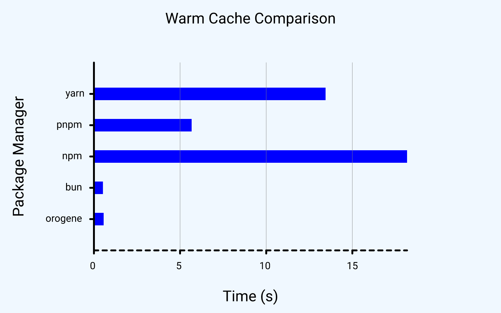
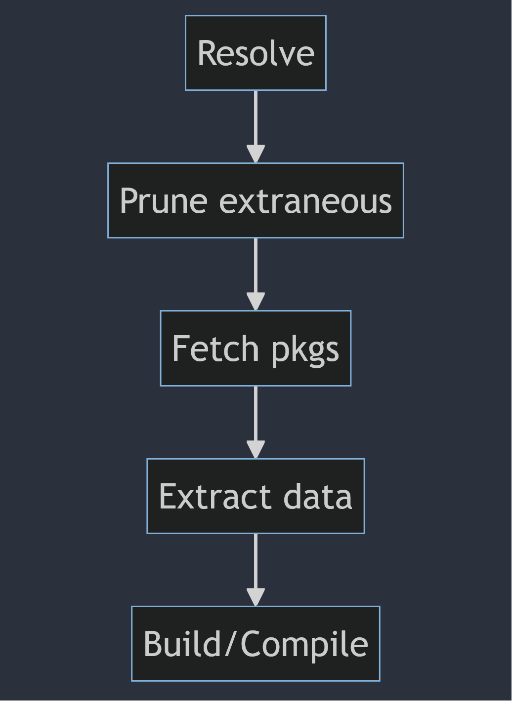
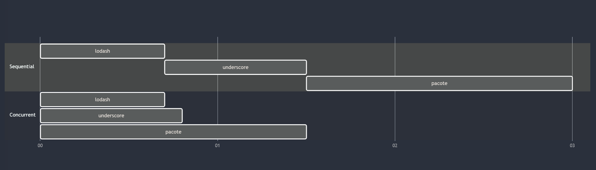
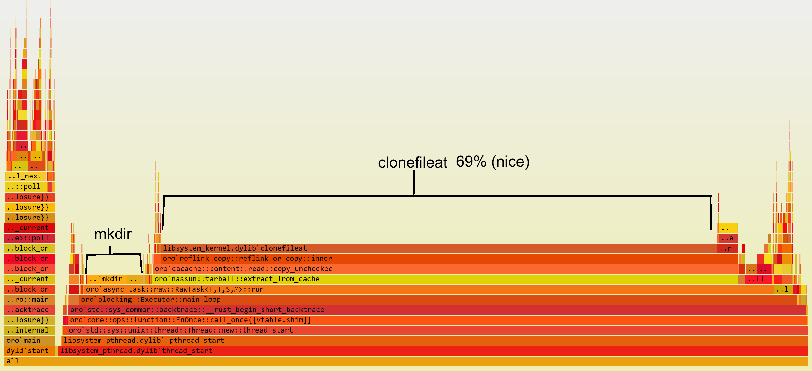
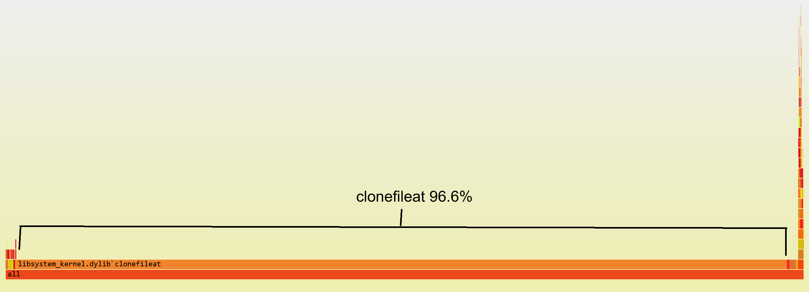

# **🦔Gotta Go Fast🏃🏽**

### How to make your users think something broke

_Kat Marchán_

<!--
* Say hi, introduce self
* Talk is going to talk in terms of language PMs but is
  relevant to system PMs too.
* The point is to knowledge-share, tricks that make users
  go "wait, did it actually work?"
-->

---

## `whoami`

* former NPM CLI architect
* Orogene maintainer (https://orogene.dev)
* obsessive speed demon

<!--
* 500x speedup for NPM install in some scenarios during the npm5/6 era.
-->

---

## `whoami`

<!--
Long story short, I spend a lot of time trying to make
charts that look like this.
-->

---

## **Stages of Installation**

<!--

* We're starting by setting some context on what
  installation typically looks like, at a high level

* Explain what each stage is

You can squash these together in various ways, but
won't necessarily see perf improvement if each step is
operating at system capacity. (Example: extracting to
destination as soon as a package got resolved did not
actually speed Orogene up, and prevented potential tree
optimization, but pnpm claims it helped them, so ymmv)
-->

---

## **What slows you down**

* Network I/O (usually slowest)
* Dependency resolution (often I/O bound)
* Syscalls (usually I/O)
* Decompressing packages (CPU-heavy)
* Doing things you don't need (design!!)

<!--
* These are the core things to watch out for. (go over each)
* Package managers mainly I/O bound, but that's not the whole story.
* All optimizations in this talk will be about one of these 5.
* Last one is important and arguably where the biggest wins ultimately are.
-->

---

## **Measure, measure, measure**

* Measure the right thing!
* Split up into diff scenarios
* Use a **variety** of **real** projects!
* Flamegraphs are your friend
* Exploratory spikes! Failure is ok!
* Take notes!

<!--
* Diff scenarios: fully cold start, cold cache, warm cache, lockfile/no lockfile, etc
* Microbenchmarks are useless. Don't try and make up imaginary projects. Use real-world ones. Users will gladly "donate" their manifests to a good cause.
* I have literally never really taken notes and I think
that's been to my great detriment.
-->

---

## **Dependency Graph Algorithms**

* Parallelizing Network I/O is **critical**
* Full SAT/ASP solvers can be very slow
* Ideally off-the-shelf, but nothing good enough
* Honorable mention: PubGrub 🍟

<!--
* Dependency graph resolution is also mostly slowed down by network I/O. Some resolvers can take a long time depending on their constraints and graph size, but there's ways around this so I try not to overindex on this.
* Off-the-shelf SAT solvers tend to be focused around problems where the entire dataset is available locally, so no async work.
* Off-the-shelf SAT solvers also might not support your ecosystem's constraints, or have good enough error reporting.
* PubGrub is a nice algorithm for both speed and error report quality, but needs to be implemented from scratch for every individual PM
-->

---

## **Stuffing the pipe**

* ~20-50 concurrent network ops ideal (test!)
* If known, start biggest downloads first
* Balance between CPU load and network saturation

<!--
* This is something to tune for your own registry. These
  numbers are what I came up with on my own testing, but
  may vary by registry and even computer.
-->

---

## **Stuffing the pipe**

<!--

-->

<!--
"But here's the real kicker..."
-->

---

# ⚠️ `async can be worse` ⚠️

<!--
Async can literally make things worse. Involves a lot of
overhead when you're not spending enough async time
waiting.
-->

---

## **Syscalls**

* Sync wins, hands-down
* Vast majority of files are fairly small
* Spreading them across thread-per-CPU is optimal
* Memoization/caching for `mkdir` ops matters

<!--

Overhead of async context switching usually much higher
than just doing things sequentially, but some level of
concurrency still good.

-->

---

## **Syscalls (Orogene)**

<!--
* Most time spent on syscalls.
* mkdir is ~5%
* Rest of stuff is async engine, logging, progress bar, misc
-->

---

## **Syscalls (Bun)**

<!--
* Basically entirely syscalls
-->

---
## **Content-addressable Caching**

* By file hash, not name+version
* Address(es) stored in lockfile or metadata

---

## **Content-addressable Caching**

<!--
TODO: Diagram for what a content-addressable cache looks
like
-->

---

## **Content-addressable Caching**

* Deduplicate files across versions or packages
* Validate data on install
* Easily avoid case-sensitivity and source repo issues
* Extraction can skip `readdir`

<!--
* most packages have identical files across versions
* dev machine local caches get corrupted. It just happens.
*
-->

---

## **Content-addressable Server Storage**

* Similar advantages to caching
* Able to reduce overall downloaded data
  * (if hosted at an individual file level)
* Conceptually immutable: highly cacheable in edge
* Allows interesting partial-package strategies

---

## **Hard links**

* Reduce disk space usage
* Accidental modification is risk

<!--
TODO: diagram of links pointing to data
-->

---

## **CoW 🐮 (Copy-on-Write)**

* APFS (macOS), ReFS (DevDrive), xfs, btrfs
* aka "reflinking" or "cloning"

---

## **CoW 🐮 (Copy-on-Write)**

#### With unmodified file:
<!--
TODO: diagram of links pointing to same data, like hard
links
-->

---

## **CoW 🐮 (Copy-on-Write)**

#### After file modified:
<!--
TODO: diagram of link being repointed to new, copied data
-->

---

## **🛌🏽 Do Less 😪**

#### The **fastest** algorithm is always **O(0)**

<!--
Here's some ideas on how to do _less_, in general.
-->

---

## **Lockfiles**

* Not just for reproducible builds!
* Skip resolution phase entirely
* Validate cache contents
* Content-address-based fetching

<!--
* Actually imporant for optimization, not just for reproducible builds.
-->

---

## **Graph optimization**

* Fewer deps, less work
* Gotta balance w/ calculation cost
* Can be its own phase!
* pnpm's link-based structure!

---

## **"unsafe" mode**

* Dev envs are chaotics, but...
* CI environments tend to be stable
* CI can skip a lot of validation

---

## **🤔 Do you really need this? 🤔**

#### **Own** your package manager.
#### **You** have the **power** to change it.

<!--
This is the hard part, really, and it comes down to a lot
of lateral thinking and creativity. It's also the most
fun part for me.

I can tell you about specific decisions I've made for
specific package managers that have specific constraints,
but in order to do this part right, you have to
understand your ecosystem, your constraints, and how far
from the expected standard workflow your users are
willing to go for the sake of blazing speed (hint:
farther than you think).

I give you permission, right now, to really let yourself
go and think outside the box: If you didn't have this one
constraint, what could you do? Or more importantly, what
could you stop doing entirely? Are you sure people care
about it that much? Can you isolate it into a specialized
"unsafe" mode?
-->

<!-- And when all else fails...-->

---

# 🦀 `Rewrite it in Rust` 🦀

---

# 🦀 `Rewrite it in Rust` 🦀

`(kidding)`

---

# 🦀 `Rewrite it in Rust` 🦀

`(kidding (mostly))`

---

# **New idea for the future?...**

* ### Virtual Package Trees!

* (Come chat in https://package.community)

<!--
I'm not quite ready to fully hash this idea publicly, but
I'm exploring a new method of installation that would be
able to defer or even skip the extraction phase entirely,
making things feel blazing fast in practice. Come talk to
me about it in package.community!
-->

---

# **Thanks!**

* https://github.com/zkat
* https://toot.cat/@zkat
* https://orogene.dev
* https://package.community

