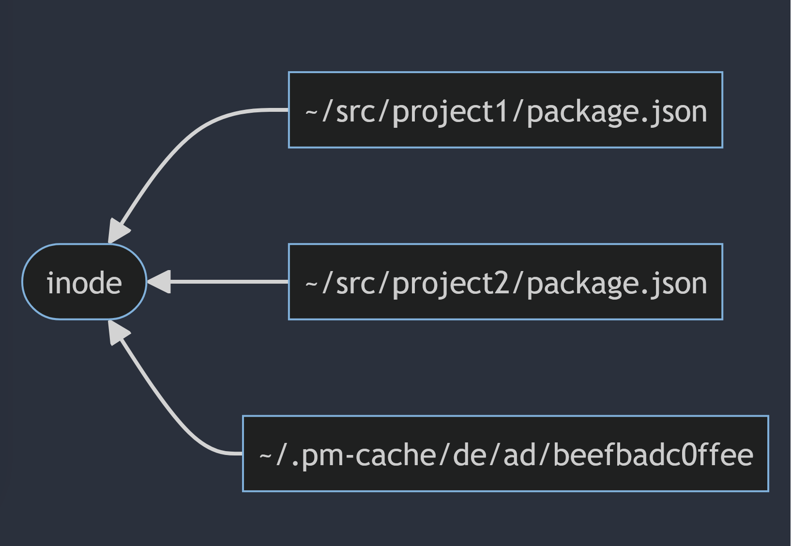
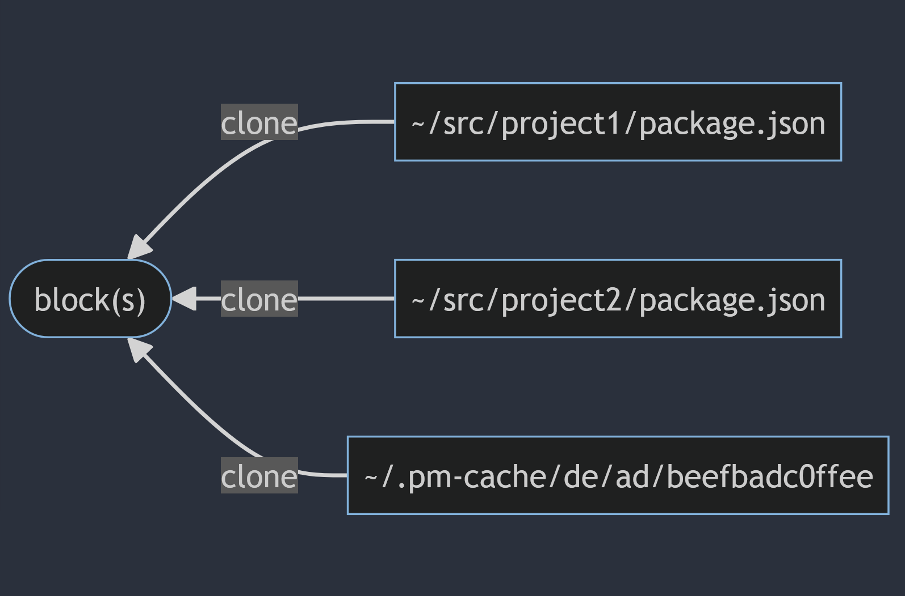
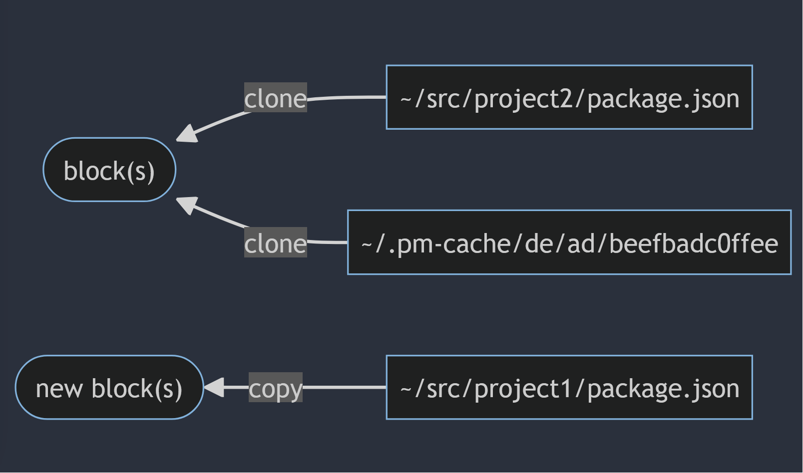

# **🦔Gotta Go Fast🏃🏽**

### How to make your users think something broke

_Kat Marchán_

<!--
* Say hi, introduce self
* Talk is going to talk in terms of language PMs but is relevant to system PMs too.
* The point is to knowledge-share, tricks that make users go "wait, did it actually work?"

Time: 30s
-->

---


## `whoami`

* former NPM CLI architect (JavaScript)
* former member of NuGet team (C#)
* Orogene maintainer (https://orogene.dev) (JS)
* obsessive speed demon 😈

<!--
* 500x speedup for NPM install in some scenarios during the npm5/6 era.

Time: 30s
-->

---

## `whoami`


<!--
What I mean by that is that I really really like making graphs that look like this.

Orogene is the one at the bottom, there.
Time: 15s
-->

---

## **Stages of Installation**


<!--

* We're starting by setting some context on what installation typically looks like, at a high level

* These steps will vary depending on whether you do isolated installs for each project, like NPM does, or you do a single-step global install.

* Resolve: This is the resolver. It's what figures out what dependencies you want in your final graph.
* Prune Extraneous: This is the process of looking at previously-installed dependencies and removing any that the newly-calculated graph doesn't need.
* Fetch packages: This is the part where you download a package from your registry, often from your global cache.
* Extract data: is where you actually crack open the package and unpack it, pulling all the files out and putting them somewhere
* Finally, your package manager might need a build or compile step, and it can do it now that everything's installed.

You can squash these together in various ways, but won't necessarily see perf improvement if each step is operating at system capacity. (Example: extracting to destination as soon as a package got resolved did not actually speed Orogene up, and prevented potential tree optimization, but pnpm claims it helped them, so ymmv)

time: 1:50s
-->

---

## **What slows you down**

* Network I/O (usually slowest)
* Dependency resolution (often I/O bound)
* Syscalls (usually I/O)
* Decompressing packages (CPU-heavy)
* Doing things you don't need (design!!)

<!--

* These are the core things to watch out for. (go over each)
  * Network: most often slowest, you have to be mindful that not everyone in the world has gigabit internet like you do.
  * Dependency resolution: depending on package manager constraints, this can be very expensive. For PMs that require "one package, one version" resolution, this is NP-Hard and can get very expensive. In either case, sequential Network I/O has the potential to be the slowest part.
  * Syscalls, most of which are file writes, creating directories, and setting permissions
  * Decompressing packages tends to be very CPU-heavy if you're not already bound by network I/O
  * Doing things you don't need is probably the worst offender of them all. You might assume you need to do things you ultimately don't actually need to do. This all comes down to design, and I think this is the most fun part, to be honest.

* Overall, Package managers mainly I/O bound, but that's not the whole story.
* All optimizations in this talk will be about one of these 5.

Time: 2m
-->

---

## **Measure, measure, measure**

* Split up into diff scenarios
* Use a **variety** of **real** projects!
* Flamegraphs are your friend
* Exploratory spikes! Failure is ok!
* Take notes!

<!--
* Diff scenarios: fully cold start, cold cache, warm cache, lockfile/no lockfile, etc
* Microbenchmarks are useless. Don't try and make up imaginary projects. Use real-world ones. Users will gladly "donate" their manifests to a good cause.
* I have literally never really taken notes and I think
that's been to my great detriment.

Time: 2m
-->

---

## **Dependency Graph Algorithms**

* Parallelizing Network I/O is **critical**
* Full SAT/ASP solvers can be very slow
* Ideally off-the-shelf, but nothing good enough
* Honorable mention: PubGrub 🍟

<!--
* Dependency graph resolution is also mostly slowed down by network I/O. Some resolvers can take a long time depending on their constraints and graph size, but there's ways around this so I try not to overindex on this.
* Off-the-shelf SAT solvers tend to be focused around problems where the entire dataset is available locally, so no async work.
* Off-the-shelf SAT solvers also might not support your ecosystem's constraints, or have good enough error reporting.
* PubGrub is a nice algorithm for both speed and error report quality, but needs to be implemented from scratch for every individual PM

Time: 2m
-->

---

## **Stuffing the pipe**

* ~20-50 concurrent network ops ideal (test!)
* If known, start biggest downloads first
* Balance between CPU load and network saturation

<!--
* This is something to tune for your own registry. These numbers are what I came up with on my own testing, but may vary by registry and even computer.

Time: 1m
-->

---

## **Stuffing the pipe**


<!--
Time: 20s
-->

<!--
"But here's the real kicker..."
-->

---

# ⚠️ `async can be worse` ⚠️


<!--
Async can literally make things worse. Involves a lot of overhead when you're not spending enough async time waiting.

Time: 20s
-->

---

## **Syscalls**

* Sync wins, hands-down
* Vast majority of files are fairly small
* Spreading them across thread-per-CPU is optimal
* Memoization/caching for `mkdir` ops matters

<!--

Overhead of async context switching usually much higher than just doing things sequentially, but some level of concurrency still good.

Time: 1m

-->

---

## **Syscalls (Orogene)**


<!--
* Most time spent on syscalls.
* mkdir is ~5%
* Rest of stuff is async engine, logging, progress bar, misc

Time: 45s
-->

---

## **Syscalls (Bun)**


<!--
* Basically entirely syscalls

Time: 20s
-->

---

## **Content-addressable Caching**

* By file hash, not name+version
* Address(es) stored in lockfile or metadata

<!--
Moving on, let's talk CAC.

Time: 45s
-->

---

## **Content-addressable Caching**

```
pm-cache/
  sha256/
    ab/
      e3/
        7885aac803db33
      f8/
        ba2112c9f2140c
        256ca5433de3c4
    d2/
      1f/
        936ecb55d7b6fc
```

<!--
This is basically what a content-addressable cache looks like. The filenames themselves are the hashes of the files. It's basically what git does.

File lookup then involves just fetching a desired hash.

Hash can be a package hash that came from a lockfile.

It can also be from metadata your registry gave.

Time: 1m
-->

---

## **Content-addressable Caching**

* Deduplicate files across versions or packages
* Validate data on install
* Easily avoid case-sensitivity and source repo issues
* Extraction can skip `readdir`

<!--
* deduplicate: most packages have identical files across versions
* validate: dev machine local caches get corrupted. It just happens.

Time: 1m30s
-->

---

## **Content-addressable Server Storage**

* Similar advantages to local caching
* Able to reduce overall downloaded data
  * (if hosted at an individual file level)
* Conceptually immutable: highly cacheable in edge

<!--
Time: 30s
-->

---

## **Hard links**

* Reduce disk space usage
* Accidental modification is risk
* Slow on macOS (!)

<!--
Time: 35s
-->

---

## **Hard Links**



<!--
Time: 10s
-->

---

## **CoW 🐮 (Copy-on-Write)**

* APFS (macOS), ReFS (DevDrive), xfs, btrfs
* aka "reflinking" or "cloning"
* Like hard links, but data gets copied if modified

<!--
Time: 50s
-->

---

### **CoW 🐮 (Copy-on-Write)**

#### With unmodified file:



<!--
Time: 15s
-->

---

### **CoW 🐮 (Copy-on-Write)**

#### After file modified:



<!--
Time: 30s
-->

---

## **🛌🏽 Do Less 😪**

#### The **fastest** algorithm is always **O(0)**

<!--
Here's some ideas on how to do _less_, in general.

Time: 15s
-->

---

## **Lockfiles**

* Not just for reproducible builds!
* Skip resolution phase entirely
* Validate cache contents
* Content-address-based fetching

<!--
* Actually imporant for optimization, not just for reproducible builds.

Time: 50s
-->

---

## **Graph optimization**

* Fewer deps, less work
* Gotta balance w/ calculation cost
* Can be its own phase!

<!--
Time: 30s
-->

---

## **"unsafe" mode**

* Dev envs are chaotic, but...
* CI environments tend to be stable
* CI can skip a lot of validation

<!--
Time: 1m
-->
---

## **🤔 Do you really need this? 🤔**

#### **Own** your package manager.
#### **You** have the **power** to change it.

<!--
This is the hard part, really, and it comes down to a lot of lateral thinking and creativity. It's also the most fun part for me.

I can tell you about specific decisions I've made for specific package managers that have specific constraints, but in order to do this part right, you have to understand your ecosystem, your constraints, and how far from the expected standard workflow your users are willing to go for the sake of blazing speed (hint: farther than you think).

I give you permission, right now, to really let yourself go and think outside the box: If you didn't have this one constraint, what could you do? Or more importantly, what could you stop doing entirely? Are you sure people care about it that much? Can you isolate it into a specialized "unsafe" mode?

Time: 1m10s
-->

<!-- And when all else fails...-->

---


# 🦀 `Rewrite it in Rust` 🦀

---


# 🦀 `Rewrite it in Rust` 🦀

`(kidding)`

---


# 🦀 `Rewrite it in Rust` 🦀

`(kidding (mostly))`

<!--
Time: 10s
-->

---

# **Thanks!**

* https://github.com/zkat
* https://toot.cat/@zkat
* https://orogene.dev
* https://package.community

<script type="module">
import mermaid from 'https://cdn.jsdelivr.net/npm/mermaid@10.5.1/dist/mermaid.esm.min.mjs';
mermaid.initialize({ startOnLoad: true });
window.addEventListener('vscode.markdown.updateContent', function() { mermaid.init() });
</script>

<!--
Time: 30s
-->
